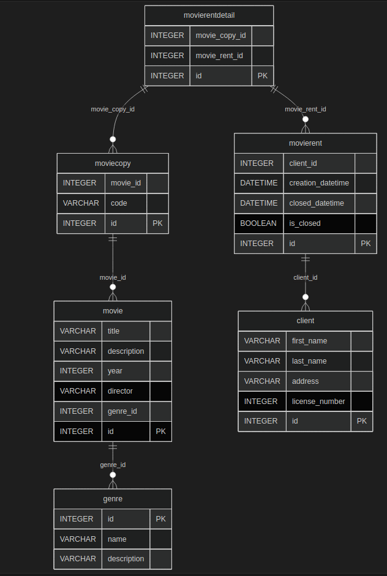
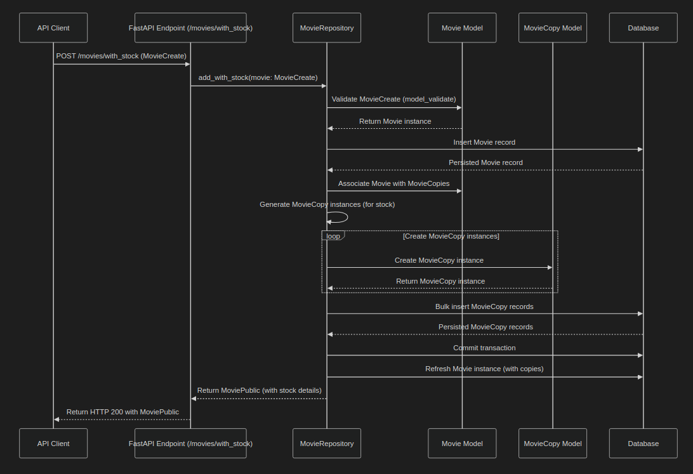
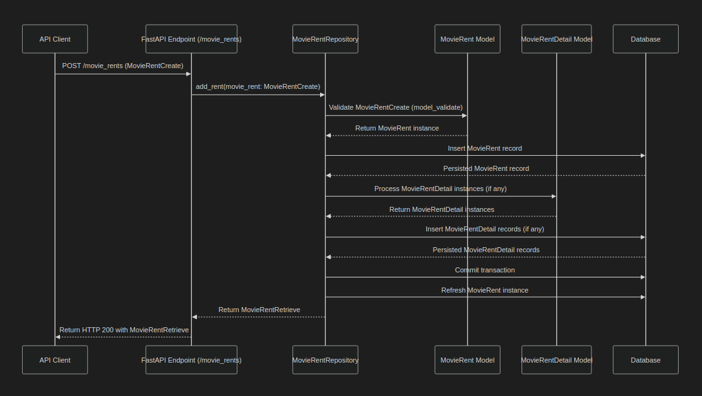

# Movies Backend

## Overview

The **Movies Backend** is a FastAPI-based project designed to manage a movie rental system. It provides a robust set of APIs for managing movies, genres, clients, and movie rentals. The project emphasizes transactional operations, ensuring data consistency and integrity for critical actions like adding movies with stock and renting movies.

---

## Features

### Main Features
- **Movies Management**: Add, update, delete, and list movies with stock management.
- **Genres Management**: Manage movie genres.
- **Clients Management**: CRUD operations for clients.
- **Movie Rentals**: Rent movies, update rentals, and close rentals.
- **Transactional APIs**:
    - **Add Movie with Stock**: Ensures atomic creation of a movie and its associated stock.
    - **Add Movie Rent**: Handles the rental process, ensuring all details are persisted correctly.

### Apps
- **Movies**: Manages movies and genres.
- **Clients**: Handles client data.
- **Movie Rents**: Manages movie rental operations.

---

## Domain Explanation

The domain revolves around a movie rental system where:
- **Movies** are categorized by **Genres**.
- **Clients** can rent movies, and each rental is tracked with details about the rented movie copies.
- **Movie Copies** represent individual physical or digital copies of a movie.

---

## Entity Relationship Diagram

Below is the entity relationship diagram (ERD) that illustrates the relationships between the entities in the system.

### Mermaid ERD
```mmd
---
id: 925060cb-d3e9-48c7-9ac9-7a518c724c18
---
erDiagram
        movierentdetail {
                INTEGER movie_copy_id
                INTEGER movie_rent_id
                INTEGER id PK
        }
        moviecopy {
                INTEGER movie_id
                VARCHAR code
                INTEGER id PK
        }
        movierent {
                INTEGER client_id
                DATETIME creation_datetime
                DATETIME closed_datetime
                BOOLEAN is_closed
                INTEGER id PK
        }
        movie {
                VARCHAR title
                VARCHAR description
                INTEGER year
                VARCHAR director
                INTEGER genre_id
                INTEGER id PK
        }
        client {
                VARCHAR first_name
                VARCHAR last_name
                VARCHAR address
                INTEGER license_number
                INTEGER id PK
        }
        genre {
                INTEGER id PK
                VARCHAR name
                VARCHAR description
        }

        movierentdetail ||--o{ movierent : "movie_rent_id"
        movierentdetail ||--o{ moviecopy : "movie_copy_id"
        moviecopy ||--o{ movie : "movie_id"
        movierent ||--o{ client : "client_id"
        movie ||--o{ genre : "genre_id"
```



---

## Transactional APIs

### Add Movie with Stock

This API allows you to create a movie along with its stock (number of copies). It ensures that both the movie and its copies are created atomically.

#### Sequence Diagram
```mmd
---
id: 297b4282-502f-40c5-a7e2-6151425fe4d4
---
sequenceDiagram
        participant Client as API Client
        participant API as FastAPI Endpoint (/movies/with_stock)
        participant Repo as MovieRepository
        participant MovieModel as Movie Model
        participant MovieCopyModel as MovieCopy Model
        participant DB as Database

        Client->>API: POST /movies/with_stock (MovieCreate)
        API->>Repo: add_with_stock(movie: MovieCreate)
        Repo->>MovieModel: Validate MovieCreate (model_validate)
        MovieModel-->>Repo: Return Movie instance
        Repo->>DB: Insert Movie record
        DB-->>Repo: Persisted Movie record
        Repo->>MovieModel: Associate Movie with MovieCopies
        Repo->>Repo: Generate MovieCopy instances (for stock)
        loop Create MovieCopy instances
                Repo->>MovieCopyModel: Create MovieCopy instance
                MovieCopyModel-->>Repo: Return MovieCopy instance
        end
        Repo->>DB: Bulk insert MovieCopy records
        DB-->>Repo: Persisted MovieCopy records
        Repo->>DB: Commit transaction
        Repo->>DB: Refresh Movie instance (with copies)
        Repo-->>API: Return MoviePublic (with stock details)
        API-->>Client: Return HTTP 200 with MoviePublic
```



#### Swagger Example
**Request**:
```json
POST /movies/with_stock
{
        "title": "The Lion King",
        "director": "Rob Minkoff · Roger Allers",
        "year": 2024,
        "description": "The Lion King movie",
        "genre_id": 1,
        "stock": 5
}
```

**Response**:
```json
{
        "id": 1,
        "title": "The Lion King",
        "director": "Rob Minkoff · Roger Allers",
        "year": 2024,
        "description": "The Lion King movie",
        "genre_id": 1,
        "copies": [
                {"id": 1, "movie_id": 1, "code": null},
                {"id": 2, "movie_id": 1, "code": null},
                {"id": 3, "movie_id": 1, "code": null},
                {"id": 4, "movie_id": 1, "code": null},
                {"id": 5, "movie_id": 1, "code": null}
        ]
}
```

---

### Add Movie Rent

This API allows a client to rent movies by specifying the movie copies they want to rent.

#### Sequence Diagram
```mmd
---
id: e1b67c73-314c-4ff9-a1e5-787b7306883b
---
sequenceDiagram
        participant Client as API Client
        participant API as FastAPI Endpoint (/movie_rents)
        participant Repo as MovieRentRepository
        participant MovieRentModel as MovieRent Model
        participant MovieRentDetailModel as MovieRentDetail Model
        participant DB as Database

        Client->>API: POST /movie_rents (MovieRentCreate)
        API->>Repo: add_rent(movie_rent: MovieRentCreate)
        Repo->>MovieRentModel: Validate MovieRentCreate (model_validate)
        MovieRentModel-->>Repo: Return MovieRent instance
        Repo->>DB: Insert MovieRent record
        DB-->>Repo: Persisted MovieRent record
        Repo->>MovieRentDetailModel: Process MovieRentDetail instances (if any)
        MovieRentDetailModel-->>Repo: Return MovieRentDetail instances
        Repo->>DB: Insert MovieRentDetail records (if any)
        DB-->>Repo: Persisted MovieRentDetail records
        Repo->>DB: Commit transaction
        Repo->>DB: Refresh MovieRent instance
        Repo-->>API: Return MovieRentRetrieve
        API-->>Client: Return HTTP 200 with MovieRentRetrieve
```



#### Swagger Example
**Request**:
```json
POST /movie_rents
{
        "client_id": 1,
        "details": [
                {"movie_copy_id": 2},
                {"movie_copy_id": 11}
        ]
}
```

**Response**:
```json
{
        "id": 1,
        "client_id": 1,
        "creation_datetime": "2025-03-19T16:15:47.662885",
        "closed_datetime": null,
        "is_closed": false,
        "details": [
                {"id": 1, "movie_copy_id": 2, "movie_rent_id": 1},
                {"id": 2, "movie_copy_id": 11, "movie_rent_id": 1}
        ]
}
```

---
## Unit Tests

### Overview
The project includes a comprehensive suite of unit tests to ensure the reliability and correctness of the implemented features. These tests cover various aspects of the application, including API endpoints, database operations, and transactional workflows.

### Key Features of Unit Tests
- **API Endpoint Testing**: Verifies the behavior of endpoints for movies, clients, and movie rentals.
- **Database Integrity**: Ensures that database operations, such as adding, updating, and deleting records, work as expected.
- **Transactional Operations**: Tests critical transactional APIs like adding movies with stock and renting movies to ensure atomicity and consistency.
- **Validation**: Confirms that invalid inputs are correctly handled with appropriate error responses.

### Test Files
The unit tests are organized into the following files:
- `movies/test_movies.py`: Contains tests for movie-related features, including adding movies with stock, updating movies, and listing movies.
- `movie_rents/test_movies_rents.py`: Includes tests for renting movies, updating rentals, and closing rentals.

### Example Test Cases
#### Movies Tests
- **`test_create_movie_with_stock_pass`**: Verifies that a movie can be created with the specified stock and that the correct number of copies is generated.
- **`test_update_movie_with_stock_fail`**: Ensures that updating a non-existent movie returns a 404 error.

#### Movie Rents Tests
- **`test_rent_movies_pass`**: Tests the successful creation of a movie rental with valid input data.
- **`test_close_movie_rent_pass`**: Verifies that a movie rental can be successfully closed and marked as completed.

### Running the Tests
To execute the unit tests, use the following command:
```bash
pytest
```
This will run all test cases and provide a detailed report of the results.

### Benefits
- **Early Bug Detection**: Identifies issues during development, reducing the risk of defects in production.
- **Code Quality Assurance**: Ensures that the code adheres to expected functionality and handles edge cases effectively.
- **Regression Prevention**: Protects against unintended changes by validating existing features after updates.

---

## Datasets and Data Loader

### Datasets Folder
The `datasets` folder contains initial data in JSON format to populate the database. These datasets include predefined records for movies, genres, clients, and other entities required to bootstrap the application. The folder structure is as follows:
```
datasets/
├── genres.json
├── movies.json
├── clients.json
└── movie_copies.json
```

### Loader Script
The `loader.py` script is responsible for loading the initial data from the `datasets` folder into the database. It uses the application's models and repositories to ensure data integrity and consistency.

#### Key Functions in `loader.py`
- **load_genres()**: Reads `genres.json` and inserts genre records into the database.
- **load_movies()**: Reads `movies.json` and adds movies along with their associated genres.
- **load_clients()**: Reads `clients.json` and populates the database with client records.
- **load_movie_copies()**: Reads `movie_copies.json` and creates movie copy records linked to their respective movies.

### Running the Loader
To load the initial data into the database, execute the following command:
```bash
python loader.py
```
This will process all datasets and populate the database with the predefined records.

---
## Challenge Requirements Met

The project fulfills the following requirements from the `Challenge.pdf`:
1. **Transactional APIs**: Ensures atomic operations for adding movies with stock and renting movies.
2. **Entity Relationships**: Properly models relationships between movies, genres, clients, and rentals.
3. **Swagger Documentation**: Provides clear examples for API usage.
4. **Data Validation**: Validates input data using Pydantic models.

---

## Getting Started

### Prerequisites
- Python 3.10+
- FastAPI
- SQLModel
- SQLite

### Installation
1. Clone the repository:
     ```bash
     git clone https://github.com/your-repo/movies_backend.git
     cd movies_backend
     ```
2. Install dependencies:
     ```bash
     pip install -r requirements.txt
     ```
3. Run the application:
     ```bash
     uvicorn main:app --reload
     ```
4. Access the API documentation at `http://127.0.0.1:8000/docs`.

---

## References

- [FastAPI Documentation](https://fastapi.tiangolo.com/)
- [SQLModel Documentation](https://sqlmodel.tiangolo.com/)
- [Pydantic Documentation](https://docs.pydantic.dev/)
- [Challenge.pdf](#)
